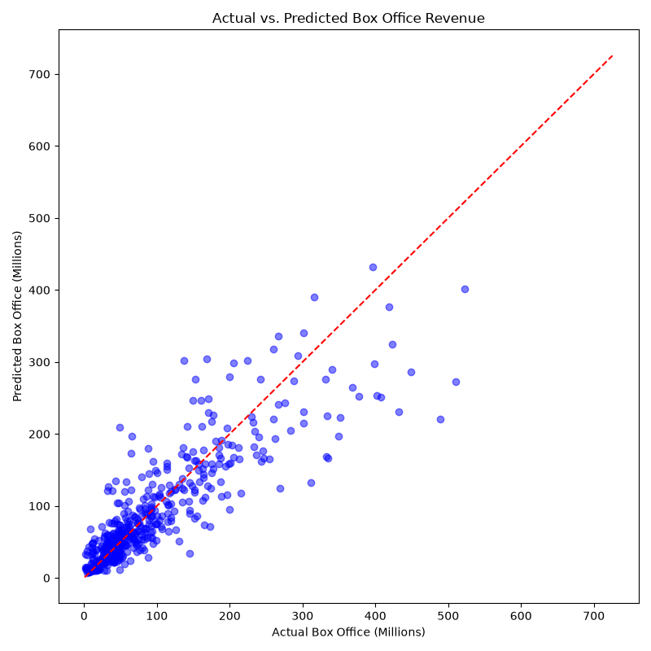

# Movie Success Prediction and Sentiment Study

## Objective
Predict a movie's financial box office success by integrating traditional metadata (budget, numerical ratings) with quantified audience sentiment extracted from textual reviews.

## Dataset
`imdb_movie_data.csv` - Contains movie titles, genres, production budgets, numerical ratings, box office revenue, and comprehensive textual user reviews.

## Tools Used
* Python (Pandas, NumPy)
* NLTK & VADER (Sentiment Analysis)
* Scikit-Learn (Random Forest Regressor)
* Matplotlib & Seaborn
* Microsoft Excel

## Project Features
* Natural Language Processing to extract compound sentiment scores from raw text.
* Genre-wise sentiment trend analysis and visualization.
* Advanced Machine Learning Regression (Random Forest) for revenue forecasting.
* Feature Importance evaluation to identify key drivers of financial success.

## Key Insights
* Audience emotional engagement (quantified via sentiment scores) is a highly significant predictor of financial success.
* While a large production budget provides the foundation for a blockbuster, it must be paired with positive sentiment to ensure profitability.
* Specific genres skew towards polarized reviews, impacting their baseline box office multipliers.
* The Random Forest model demonstrates that qualitative text data can successfully enhance quantitative financial models.

## Outcome
Successfully built and validated a robust regression model that proves audience sentiment acts as a major quantifiable predictor of box office revenue, providing a valuable analytical framework for the entertainment industry.

---

## Dashboard / Project Preview 
```markdown

```

---

## Files Included
* Main Project File (`Movie_Success_Sentiment_Study.ipynb`)
* Project Documentation (`Movie_Success_Project_Documentation_v3.pdf`)
* Model Results Visualization (`Sentiment_Model_Results.png`)
* Feature Importance Visual (`Feature_Importance.png`)
* Genre Trends Visual (`Genre_Sentiment_Trends.png`)
* Exported Insights (`Genre_Sentiment.xlsx`)
* Dataset (`imdb_movie_data.csv`)
* README File (`README.md`)

